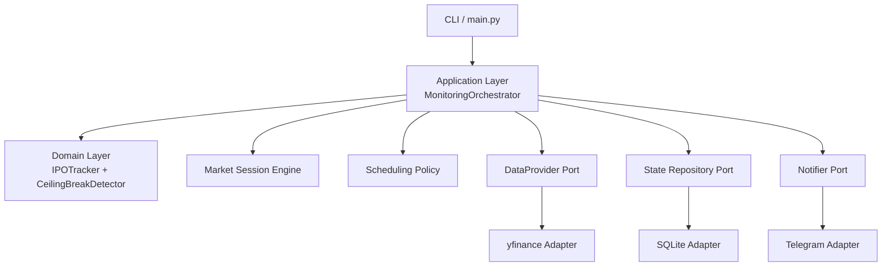
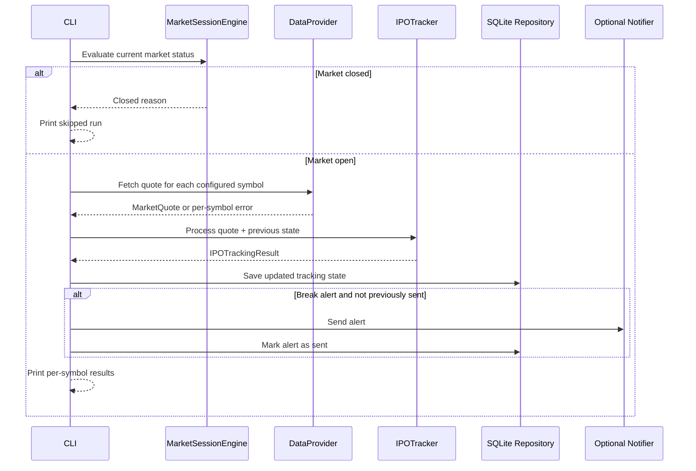

# BIST Market Monitor

[](https://github.com/emreturgayie/bist-market-monitor/actions/workflows/ci.yml)


A production-oriented Python monitoring system for Borsa Istanbul IPO ceiling-break signals.

The first module in this project focuses on IPO stocks that repeatedly trade at their daily ceiling
price. It tracks each symbol's ceiling streak, detects potential ceiling breaks, persists local state,
and can send optional Telegram alerts.

> This project is not investment advice. It is an engineering portfolio project and does not place
> orders, execute trades, or recommend buying or selling securities.

## Problem Statement

Newly listed BIST stocks may spend multiple sessions at the daily upper price limit. A potential
ceiling break can matter to investors who are already manually monitoring these symbols, but manual
tracking is repetitive and error-prone.

This project provides a modular monitoring foundation that can:

- track selected IPO symbols,
- determine whether a quote is still at the theoretical ceiling,
- persist tracking state across restarts,
- avoid repeated alerts for the same break state,
- respect market session status,
- run locally through a CLI or Docker Compose.

## Key Features

- Clean Architecture with clear domain, application, adapter, and infrastructure boundaries
- Domain-level ceiling-break detection using `Decimal` for financial calculations
- IPO tracking state with consecutive ceiling-day counting
- Market session engine with configurable market hours, timezone, weekends, and holidays
- Adaptive monitoring schedule policy for early and hourly monitoring modes
- Data provider abstraction with a yfinance adapter
- SQLite persistence with schema versioning and integrity constraints
- Optional Telegram notification adapter with retry and error handling
- End-to-end CLI for one monitoring cycle
- Docker and Docker Compose support with SQLite data persisted via volume
- GitHub Actions CI for tests, linting, formatting, and typing
- 113 automated tests

## Architecture Overview



## Components

### Domain

Pure business logic lives in `src/tavan_takip/domain/`.

- `MarketQuote`: immutable quote model
- `IPOTrackingConfig`: per-symbol monitoring configuration
- `CeilingCalculator`: theoretical ceiling-price calculation
- `CeilingBreakDetector`: break/no-break decision engine
- `IPOTracker`: consecutive ceiling-day tracking and lifecycle state

The domain layer does not depend on yfinance, SQLite, Telegram, Docker, or the CLI.

### Application

Application orchestration lives in `src/tavan_takip/application/`.

- `MonitoringOrchestrator`: coordinates market status, quote retrieval, tracking, persistence, and notifications
- CLI helper functions render readable local output
- Provider and notification failures are reported per symbol when possible

### Data Providers

Data provider abstractions live in `src/tavan_takip/data_providers/`.

- `DataProvider`: interface for retrieving quotes
- `YFinanceProvider`: first adapter, intended for demo/delayed market data

### Persistence

Persistence adapters live in `src/tavan_takip/persistence/`.

- SQLite-backed IPO tracking state repository
- local schema version table
- integrity constraints for tracking state
- break-alert deduplication table

### Notifications

Notification ports and adapters live in `src/tavan_takip/notifications/`.

- `Notifier`: delivery interface
- `NotificationMessage`: provider-independent message model
- `TelegramNotifier`: Telegram Bot API adapter

Telegram is optional and only enabled when both token and chat ID are configured.

### Scheduler

Scheduling policy lives in `src/tavan_takip/scheduler/`.

- early monitoring mode: 3-4 configured check windows per trading day
- hourly monitoring mode: hourly checks during market hours
- market-aware next-run decisions

This layer is pure policy. It does not run an infinite loop and does not call external APIs.

### Market Session

Market calendar/session logic lives in `src/tavan_takip/market/`.

- default timezone: `Europe/Istanbul`
- configurable open and close times
- weekend and configured holiday handling
- timezone-aware datetime validation

### CLI

The CLI runs one monitoring cycle and prints structured output. It is intentionally simple and does
not schedule recurring runs yet.

## Folder Structure

```text
.
├── src/tavan_takip/
│   ├── application/      # orchestration and CLI helpers
│   ├── data_providers/   # provider ports and yfinance adapter
│   ├── domain/           # pure business rules and models
│   ├── market/           # market calendar/session logic
│   ├── notifications/    # notifier ports and Telegram adapter
│   ├── persistence/      # repository ports and SQLite adapter
│   ├── scheduler/        # adaptive schedule policy
│   ├── config.py         # pydantic-settings configuration
│   └── main.py           # console entry point
├── tests/unit/           # unit tests
├── Dockerfile
├── docker-compose.yml
├── pyproject.toml
└── README.md
```

## How It Works End-to-End



## Installation

### Local Python

```bash
python3 -m venv .venv
source .venv/bin/activate
pip install -e ".[dev]"
```

### Docker Compose

```bash
cp .env.example .env
# Edit .env and set TAVAN_TAKIP_TRACKED_SYMBOLS
docker compose up --build
```

SQLite data is stored in the Compose volume at `/data/tavan_takip.sqlite3`.

## Configuration

Configuration is loaded with `pydantic-settings` using the `TAVAN_TAKIP_` prefix.

| Variable | Required | Default | Description |
| --- | --- | --- | --- |
| `TAVAN_TAKIP_TRACKED_SYMBOLS` | Yes for monitoring | empty | Comma-separated symbols, for example `THYAO.IS,SISE.IS` |
| `TAVAN_TAKIP_YFINANCE_RETRY_ATTEMPTS` | No | `3` | Retry attempts for yfinance provider failures |
| `TAVAN_TAKIP_YFINANCE_RETRY_WAIT_SECONDS` | No | `1.0` | Wait time between yfinance retries |
| `TAVAN_TAKIP_SQLITE_DATABASE_PATH` | No | `tavan_takip.sqlite3` locally, `/data/tavan_takip.sqlite3` in Docker | SQLite state database path |
| `TAVAN_TAKIP_TELEGRAM_BOT_TOKEN` | No | empty | Telegram bot token. Leave empty to disable Telegram |
| `TAVAN_TAKIP_TELEGRAM_CHAT_ID` | No | empty | Telegram chat ID. Leave empty to disable Telegram |
| `TAVAN_TAKIP_TELEGRAM_RETRY_ATTEMPTS` | No | `3` | Retry attempts for transient Telegram failures |
| `TAVAN_TAKIP_TELEGRAM_RETRY_WAIT_SECONDS` | No | `1.0` | Wait time between Telegram retries |

## Running the CLI

With an activated virtual environment:

```bash
TAVAN_TAKIP_TRACKED_SYMBOLS=THYAO.IS,SISE.IS tavan-takip
```

Or through Python:

```bash
TAVAN_TAKIP_TRACKED_SYMBOLS=THYAO.IS python -m tavan_takip.main
```

If Telegram variables are not configured, the CLI still runs and prints local results only.

## Example Output

```text
BIST IPO Ceiling Break Alert System
Checked at: 2026-01-05T10:30:00+03:00
Market status: open
Monitoring results:
- ORNEK.IS: BREAK SIGNAL; price=10.95; ceiling=11.00; gap=0.05; mode=early; ceiling_days=0
  Break reason: ceiling_break
  Notification: sent
Not investment advice.
```

Actual output depends on market status, configured symbols, provider data, and notification settings.

## Tests and Quality Checks

```bash
pytest
ruff check .
black --check .
mypy src tests
```

The current suite contains 113 tests covering domain logic, orchestration, persistence, notification
formatting, Telegram HTTP behavior with mocked clients, scheduler policy, and CLI output.

## Docker Usage

Build and run locally:

```bash
cp .env.example .env
docker compose up --build
```

Run one command and remove the container afterward:

```bash
docker compose run --rm app
```

The image runs as a non-root user. The `.env` file is not copied into the image. SQLite data is
persisted through the `sqlite-data` Docker volume.

## GitHub Actions / CI

The repository includes a GitHub Actions workflow at `.github/workflows/ci.yml`.

CI runs on pushes and pull requests to `main`:

- install the project with development dependencies
- run `pytest`
- run `ruff check .`
- run `black --check .`
- run `mypy src tests`

## Safety and Legal Disclaimer

- This project is not investment advice.
- It does not place orders or execute trades.
- It does not recommend buying, selling, or holding securities.
- The current yfinance adapter is suitable for demo/development use and may provide delayed,
  incomplete, or inaccurate market data.
- Always verify market data with official or licensed sources before making financial decisions.

## Current Limitations

- No production scheduler loop is implemented yet.
- No Docker-based deployment workflow is included in CI yet.
- yfinance is the only data provider adapter.
- BIST-specific tick-size and holiday rules are simplified and configurable, not official.
- Telegram is the only notification adapter.
- SQLite is local-only and intended for single-process/local operation.

## Roadmap

- Production scheduling loop
- Official or licensed BIST-compatible data provider adapter
- Better BIST calendar and half-day session support
- Richer alert deduplication and alert history
- Docker image build validation in CI
- Additional notification channels
- Documentation site or architecture decision records

## Portfolio / Engineering Highlights

- Clean Architecture boundaries enforced through package design
- Domain logic is deterministic, typed, and heavily tested
- External services are behind ports and adapters
- Financial calculations use `Decimal`
- Persistence uses explicit repositories and schema versioning
- Notification failures do not crash monitoring runs
- Docker image avoids shipping local secrets and runs as non-root
- CI mirrors local quality gates

## Contributing

Issues and pull requests are welcome. Before submitting a change, run:

```bash
pytest
ruff check .
black --check .
mypy src tests
```

Please keep the project focused on monitoring and alerting only. Automatic trading and order
execution are intentionally out of scope.

## License

See [LICENSE](LICENSE). If you reuse or adapt this project, review the license file and keep the
financial safety disclaimer visible.
