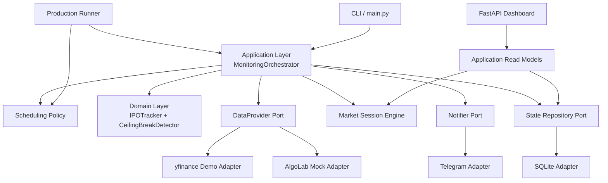
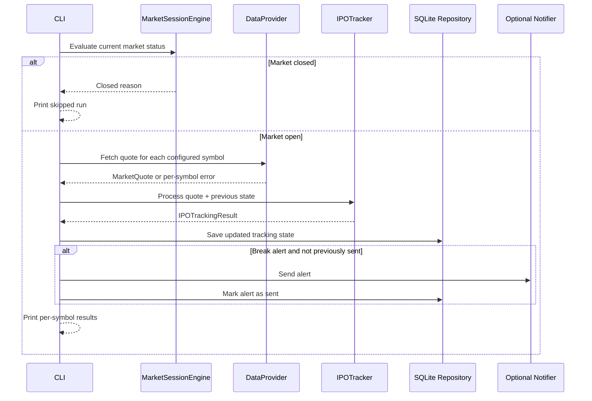

# BIST Market Monitor

[](https://github.com/emreturgayie/bist-market-monitor/actions/workflows/ci.yml)


A production-oriented Python monitoring system for Borsa Istanbul IPO ceiling-break signals.

The first module in this project focuses on IPO stocks that repeatedly trade at their daily ceiling
price. It tracks each symbol's ceiling streak, detects potential ceiling breaks, persists local state,
and can send optional Telegram alerts.

> This project is not investment advice. It is an engineering portfolio project and does not place
> orders, execute trades, or recommend buying or selling securities.

## Project Status

`v1.0.0` is the first stable open-source portfolio release. The project is ready for local Docker
deployment and demonstration use, with clear limitations around market data quality, authentication,
and real-time provider integration.

## Release

- Current version: `1.0.0`
- Release notes: [RELEASE.md](RELEASE.md)
- Changelog: [CHANGELOG.md](CHANGELOG.md)
- Security policy: [SECURITY.md](SECURITY.md)
- Contributing guide: [CONTRIBUTING.md](CONTRIBUTING.md)

## Support Matrix

| Area | Supported in v1.0.0 | Notes |
| --- | --- | --- |
| Python | `3.14` | CI and Docker target Python 3.14 |
| Runtime | Local Python, Docker Compose | Docker Compose runs the production runner by default |
| Persistence | SQLite | Intended for local/single-process operation |
| Data providers | yfinance, AlgoLab mock | yfinance is demo/delayed; AlgoLab is mock-only |
| Notifications | Telegram | Optional; requires bot token and chat ID |
| Dashboard | Read-only FastAPI dashboard | Authentication is future work |
| Trading | Not supported | No broker integration or order execution |

## Problem Statement

Newly listed BIST stocks may spend multiple sessions at the daily upper price limit. A potential
ceiling break can matter to investors who are already manually monitoring these symbols, but manual
tracking is repetitive and error-prone.

This project provides a modular monitoring foundation that can:

- track selected IPO symbols,
- determine whether a quote is still at the theoretical ceiling,
- persist tracking state across restarts,
- avoid repeated alerts for the same break state,
- respect market session status,
- run locally through a CLI or Docker Compose.

## Key Features

- Clean Architecture with clear domain, application, adapter, and infrastructure boundaries
- Domain-level ceiling-break detection using `Decimal` for financial calculations
- IPO tracking state with consecutive ceiling-day counting
- Market session engine with configurable market hours, timezone, weekends, and holidays
- Adaptive monitoring schedule policy for early and hourly monitoring modes
- Selectable data provider architecture with yfinance demo data and an AlgoLab mock adapter
- SQLite persistence with schema versioning and integrity constraints
- Optional Telegram notification adapter with retry and error handling
- End-to-end CLI for one monitoring cycle
- Long-running production runner that reuses the scheduler policy and monitoring orchestrator
- FastAPI dashboard with persisted state, recent alerts, system status, HTMX updates, and Chart.js
  visualization
- Docker and Docker Compose support with SQLite data persisted via volume
- GitHub Actions CI for tests, linting, formatting, and typing
- 136 automated tests

## Documentation

- [Architecture](docs/architecture.md): system overview, Clean Architecture boundaries, layers,
  dependency direction, and current limitations.
- [Data Flow](docs/data-flow.md): end-to-end monitoring flow, quote processing, alert
  deduplication, persistence, and notification behavior.
- [Deployment](docs/deployment.md): local development, Docker Compose, environment variables,
  SQLite volume, CI/CD overview, and security notes.
- [Architecture Decisions](docs/decisions.md): lightweight ADRs for the major engineering choices.
- [Roadmap](docs/roadmap.md): completed milestones, short-term work, long-term work, and explicit
  future scope.
- [Release Notes](RELEASE.md): v1.0.0 highlights, features, limitations, and roadmap.
- [Security](SECURITY.md): security scope, financial safety, secrets, and disclosure guidance.
- [Contributing](CONTRIBUTING.md): development workflow, style, tests, and contribution rules.

## Portfolio Materials

These materials are written for CVs, GitHub profiles, LinkedIn posts, demos, and technical
interviews:

- [Portfolio Overview](docs/portfolio.md): project story, technical highlights, skills
  demonstrated, and interview positioning.
- [Interview Guide](docs/interview-guide.md): 30-second, 2-minute, and 5-minute explanations plus
  common interview questions.
- [CV Text](docs/cv.md): English and Turkish project descriptions in multiple lengths.
- [LinkedIn Post Drafts](docs/linkedin-post.md): launch post options with an honest safety note.
- [Demo Script](docs/demo-script.md): CLI, dashboard, Docker, 1-minute, and 3-minute demo flows.

## Architecture At A Glance



The domain layer contains deterministic business rules and does not depend on yfinance, SQLite,
Telegram, Docker, or the CLI. Infrastructure concerns are isolated behind ports and adapters.

## Folder Structure

```text
.
├── src/tavan_takip/
│   ├── application/      # orchestration and CLI helpers
│   ├── data_providers/   # provider ports, factory, yfinance demo, and AlgoLab mock
│   ├── dashboard/        # FastAPI routes, Jinja2 templates, and static assets
│   ├── domain/           # pure business rules and models
│   ├── market/           # market calendar/session logic
│   ├── notifications/    # notifier ports and Telegram adapter
│   ├── persistence/      # repository ports and SQLite adapter
│   ├── scheduler/        # adaptive schedule policy
│   ├── config.py         # pydantic-settings configuration
│   ├── runner.py         # production runner entry point
│   └── main.py           # console entry point
├── tests/unit/           # unit tests
├── docs/                 # architecture, flow, deployment, decisions, and roadmap
├── Dockerfile
├── docker-compose.yml
├── pyproject.toml
└── README.md
```

## Monitoring Flow



See [Data Flow](docs/data-flow.md) for the detailed flow, including provider failures, alert
deduplication, persistence, and Telegram notification handling.

## Installation

### Local Python

```bash
python3 -m venv .venv
source .venv/bin/activate
pip install -e ".[dev]"
```

For runtime-only use, install without development tools:

```bash
pip install .
```

### Docker Compose

```bash
cp .env.example .env
# Edit .env and set TAVAN_TAKIP_TRACKED_SYMBOLS
docker compose up --build
```

SQLite data is stored in the Compose volume at `/data/tavan_takip.sqlite3`.

## Configuration

Configuration is loaded with `pydantic-settings` using the `TAVAN_TAKIP_` prefix.

| Variable | Required | Default | Description |
| --- | --- | --- | --- |
| `TAVAN_TAKIP_TRACKED_SYMBOLS` | Yes for monitoring | empty | Comma-separated symbols, for example `THYAO.IS,SISE.IS` |
| `TAVAN_TAKIP_DATA_PROVIDER` | No | `yfinance` | Data provider adapter. Supported values: `yfinance`, `algolab_mock` |
| `TAVAN_TAKIP_YFINANCE_RETRY_ATTEMPTS` | No | `3` | Retry attempts for yfinance provider failures |
| `TAVAN_TAKIP_YFINANCE_RETRY_WAIT_SECONDS` | No | `1.0` | Wait time between yfinance retries |
| `TAVAN_TAKIP_SQLITE_DATABASE_PATH` | No | `tavan_takip.sqlite3` locally, `/data/tavan_takip.sqlite3` in Docker | SQLite state database path |
| `TAVAN_TAKIP_TELEGRAM_BOT_TOKEN` | No | empty | Telegram bot token. Leave empty to disable Telegram |
| `TAVAN_TAKIP_TELEGRAM_CHAT_ID` | No | empty | Telegram chat ID. Leave empty to disable Telegram |
| `TAVAN_TAKIP_TELEGRAM_RETRY_ATTEMPTS` | No | `3` | Retry attempts for transient Telegram failures |
| `TAVAN_TAKIP_TELEGRAM_RETRY_WAIT_SECONDS` | No | `1.0` | Wait time between Telegram retries |

## Running the CLI

With an activated virtual environment:

```bash
TAVAN_TAKIP_TRACKED_SYMBOLS=THYAO.IS,SISE.IS tavan-takip
```

Or through Python:

```bash
TAVAN_TAKIP_TRACKED_SYMBOLS=THYAO.IS python -m tavan_takip.main
```

If Telegram variables are not configured, the CLI still runs and prints local results only.

## Running the Dashboard

With an activated virtual environment:

```bash
TAVAN_TAKIP_TRACKED_SYMBOLS=THYAO.IS,SISE.IS tavan-takip-dashboard
```

Then open `http://127.0.0.1:8000`.

The dashboard reads persisted SQLite state and alert records. It does not replace the CLI and does
not fetch quotes by itself.

## Running the Production Runner

With an activated virtual environment:

```bash
TAVAN_TAKIP_TRACKED_SYMBOLS=THYAO.IS,SISE.IS tavan-takip-runner
```

The runner uses the adaptive scheduler policy, persists runner status in SQLite, and stops cleanly
on `Ctrl+C`.

## Example Output

```text
BIST IPO Ceiling Break Alert System
Checked at: 2026-01-05T10:30:00+03:00
Market status: open
Monitoring results:
- ORNEK.IS: BREAK SIGNAL; price=10.95; ceiling=11.00; gap=0.05; mode=early; ceiling_days=0
  Break reason: ceiling_break
  Notification: sent
Not investment advice.
```

Actual output depends on market status, configured symbols, provider data, and notification settings.

## Tests and Quality Checks

```bash
pytest
ruff check .
black --check .
mypy src tests
```

The current suite contains 136 tests covering domain logic, orchestration, persistence, production
runner behavior, dashboard rendering, data provider selection, notification formatting, Telegram HTTP
behavior with mocked clients, scheduler policy, and CLI output.

## Docker Usage

Build and run the production runner locally:

```bash
cp .env.example .env
docker compose up --build
```

Run one CLI monitoring cycle and remove the container afterward:

```bash
docker compose run --rm app
```

Run the dashboard service:

```bash
docker compose --profile dashboard up dashboard --build
```

The image runs as a non-root user. The `.env` file is not copied into the image. SQLite data is
persisted through the `sqlite-data` Docker volume.

## GitHub Actions / CI

The repository includes a GitHub Actions workflow at `.github/workflows/ci.yml`.

CI runs on pushes and pull requests to `main`:

- install the project with development dependencies
- run `pytest`
- run `ruff check .`
- run `black --check .`
- run `mypy src tests`

## Safety and Legal Disclaimer

- This project is not investment advice.
- It does not place orders or execute trades.
- It does not recommend buying, selling, or holding securities.
- The current yfinance adapter is suitable for demo/development use and may provide delayed,
  incomplete, or inaccurate market data.
- `algolab_mock` is a network-free placeholder for future AlgoLab integration; it is not a real-time
  production data feed.
- Always verify market data with official or licensed sources before making financial decisions.

## Current Limitations

- No Docker-based deployment workflow is included in CI yet.
- yfinance is the only implemented external data adapter and is intended for demo/delayed data.
- AlgoLab is represented by a mock adapter only; real-time AlgoLab integration is planned future work.
- BIST-specific tick-size and holiday rules are simplified and configurable, not official.
- Telegram is the only notification adapter.
- SQLite is local-only and intended for single-process/local operation.
- The dashboard is read-only and shows persisted state plus runner status; it does not run
  monitoring cycles.

## Roadmap

- Real AlgoLab or another licensed BIST-compatible data provider adapter
- Better BIST calendar and half-day session support
- Richer alert deduplication and alert history
- Docker image build validation in CI
- Additional notification channels
- Documentation site or expanded architecture decision records

## Portfolio / Engineering Highlights

- Clean Architecture boundaries enforced through package design
- Domain logic is deterministic, typed, and heavily tested
- External services are behind ports and adapters
- Financial calculations use `Decimal`
- Persistence uses explicit repositories and schema versioning
- Notification failures do not crash monitoring runs
- Dashboard reads application-level view models instead of embedding business logic in routes
- Docker image avoids shipping local secrets and runs as non-root
- CI mirrors local quality gates

## Contributing

Issues and pull requests are welcome. Before submitting a change, run:

```bash
pytest
ruff check .
black --check .
mypy src tests
```

Please keep the project focused on monitoring and alerting only. Automatic trading and order
execution are intentionally out of scope.

## License

See [LICENSE](LICENSE). If you reuse or adapt this project, review the license file and keep the
financial safety disclaimer visible.
