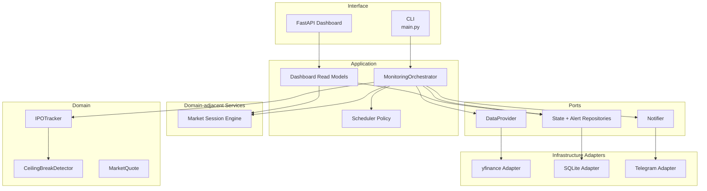

# Architecture

## System Overview

BIST Market Monitor is a modular Python monitoring application. The current product surfaces are a
one-shot CLI and a read-only FastAPI dashboard. The CLI can evaluate configured BIST IPO symbols,
persist local tracking state, and send optional Telegram alerts when the ceiling-break detector
emits an alertable signal. The dashboard visualizes persisted state, recent alert records, market
status, and runtime configuration.

The system is intentionally built as a platform foundation rather than a single script. The IPO
ceiling-break detector is the first monitoring module; future modules can reuse the same market
session, scheduling, persistence, notification, and orchestration patterns.

## Clean Architecture Boundaries

The repository follows Clean Architecture principles:

- Business rules are in the domain layer.
- Application orchestration depends on domain ports and adapters, not concrete external services.
- Infrastructure adapters implement external concerns such as yfinance, SQLite, and Telegram.
- Domain objects do not import yfinance, SQLite, Telegram, Docker, CLI, or dashboard modules.

Dependency direction:

```text
Infrastructure adapters -> Application -> Domain
                          -> Market/session policy
                          -> Scheduler policy
```

The domain layer is the most stable part of the system. Infrastructure can be replaced without
changing the domain rules.

## Main Layers

### Domain Layer

Location: `src/tavan_takip/domain/`

Responsibilities:

- represent market quotes,
- calculate theoretical ceiling prices,
- detect ceiling-break signals,
- track IPO ceiling streak state,
- expose deterministic business decisions.

The domain layer is pure Python and has no side effects.

### Application Layer

Location: `src/tavan_takip/application/`

Responsibilities:

- evaluate market session status,
- coordinate quote fetching,
- pass quotes through the IPO tracker,
- persist updated state when a repository is injected,
- send notifications when a notifier is injected,
- render CLI output,
- build dashboard read models from settings and repository ports.

The application layer coordinates work but avoids embedding business rules that belong in the domain.

### Dashboard Interface

Location: `src/tavan_takip/dashboard/`

Responsibilities:

- expose FastAPI routes,
- render Jinja2 templates,
- serve static dashboard assets,
- use HTMX for lightweight table refreshes,
- use Chart.js for simple persisted-state visualization.

The dashboard is read-only. It does not fetch quotes, send notifications, or run monitoring cycles.

### Data Provider Layer

Location: `src/tavan_takip/data_providers/`

Responsibilities:

- define the `DataProvider` port,
- adapt yfinance into the project's `MarketQuote` model,
- isolate provider-specific errors and retry behavior.

### Persistence Layer

Location: `src/tavan_takip/persistence/`

Responsibilities:

- define repository protocols,
- persist `IPOTrackingState` to SQLite,
- maintain schema versioning,
- enforce simple integrity constraints,
- store alert deduplication state.

### Notification Layer

Location: `src/tavan_takip/notifications/`

Responsibilities:

- define notification message and notifier abstractions,
- implement Telegram Bot API delivery,
- handle HTTP failures and retry transient errors.

### Market Session Layer

Location: `src/tavan_takip/market/`

Responsibilities:

- determine whether the market is open or closed at a given time,
- handle weekends and configured holidays,
- support configurable open and close times,
- enforce timezone-aware datetime input.

### Scheduler Policy Layer

Location: `src/tavan_takip/scheduler/`

Responsibilities:

- decide the next monitoring run time,
- support early and hourly monitoring modes,
- avoid duplicate runs inside the same planned window,
- respect market calendar constraints.

The scheduler is policy-only. It does not run an infinite loop.

## Component Diagram



## Why This Architecture Was Chosen

This architecture was chosen to keep the system easy to test and extend:

- The ceiling-break rules can be tested without network access.
- yfinance can be replaced with a licensed or real-time provider later.
- SQLite can be replaced with another persistence mechanism later.
- Telegram can be replaced or supplemented by another notification channel.
- Scheduler logic can evolve into a production runner without changing domain rules.
- The dashboard can evolve independently because it consumes application read models instead of
  domain internals.

The tradeoff is a slightly larger file/module structure than a simple script. That cost is acceptable
because the project is intended to demonstrate maintainable, production-style engineering.

## Current Limitations

- The CLI runs one monitoring cycle; it does not run continuously.
- The dashboard is read-only and shows persisted state; it does not run monitoring cycles.
- yfinance is a demo/delayed data adapter and is not an official BIST data source.
- BIST tick-size and holiday rules are simplified.
- SQLite is intended for local/single-process use.
- Telegram is the only implemented notification adapter.
- Docker is available for local execution, but CI does not currently build the Docker image.
