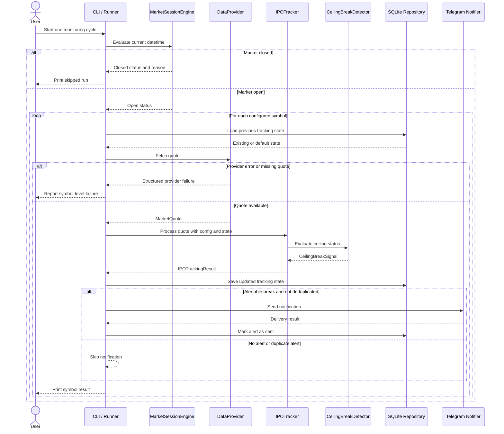

# Data Flow

## End-to-End Monitoring Flow

The monitoring flow starts from the CLI or another future runner and executes one monitoring cycle.
The cycle is intentionally explicit: market status is evaluated first, quotes are fetched only when
the market is open, each symbol is processed independently, state is persisted, and optional
notifications are sent only for alertable signals that have not already been sent.

The current application does not run an infinite loop. The adaptive scheduler policy decides when a
future run should happen, but a production runner is future work.

## Sequence Diagram

## Market Session Decision

The market session engine is evaluated before any data provider is called.

Possible outcomes include:

- `open`: quote fetching and tracking may proceed.
- `before_open`: monitoring is skipped until the market opens.
- `after_close`: monitoring is skipped until a future trading session.
- `weekend`: monitoring is skipped.
- `holiday`: monitoring is skipped for a configured holiday.

This protects external providers and notification channels from unnecessary calls outside market
hours. Datetimes are timezone-aware, with `Europe/Istanbul` as the default timezone.

## Data Provider Fetch

The orchestrator asks the configured `DataProvider` for quotes only when the market is open. The
provider returns project-level `MarketQuote` objects rather than leaking provider-specific models
into the domain.

Provider failures are captured per symbol where possible:

- no-data cases are reported as missing quotes,
- provider errors are reported as symbol-level failures,
- one failed symbol does not prevent other symbols from being processed.

Tests mock provider behavior and do not perform network requests.

## Tracking Engine

The `IPOTracker` receives:

- the current `MarketQuote`,
- the per-symbol `IPOTrackingConfig`,
- the previous `IPOTrackingState`.

It updates the explicit state model by counting consecutive ceiling days, avoiding double-counts for
the same trading date, switching monitoring mode after the configured threshold, and resetting the
streak when a break signal is emitted.

The tracker remains independent from persistence. State is passed in and returned explicitly.

## Ceiling Break Detection

The `CeilingBreakDetector` calculates a theoretical ceiling price through the `CeilingCalculator`
and compares the current quote against that ceiling.

Important behavior:

- financial calculations use `Decimal`,
- the daily limit percentage is configurable,
- tolerance prevents tiny one-tick differences from creating false positives,
- detector output is a structured `CeilingBreakSignal`.

The detector has no dependency on yfinance, Telegram, SQLite, the CLI, or the scheduler.

## Alert Deduplication

Alert deduplication prevents repeated Telegram notifications for the same broken state. The
application checks whether the current break state has already been notified before calling the
notifier.

The deduplication state is stored outside the domain so business rules stay clean. SQLite currently
persists the deduplication marker, and the design can be extended to another repository adapter
later.

## Persistence

When a repository is injected, the application persists tracking state after processing a symbol.
The SQLite adapter stores:

- symbol,
- consecutive ceiling days,
- last processed trading date,
- lifecycle state,
- monitoring mode,
- updated timestamp.

The SQLite layer also owns schema versioning and integrity constraints. Domain models do not import
SQLite code.

## Telegram Notification

Telegram delivery is optional. If the Telegram token or chat ID is not configured, monitoring still
runs and prints local results.

Notifications are sent only when:

- the market is open,
- quote processing produced an alertable break signal,
- the signal is not suppressed by tolerance/noise filtering,
- the current break state has not already been notified.

Notification failures are surfaced in structured monitoring results and should not crash an entire
monitoring run.
